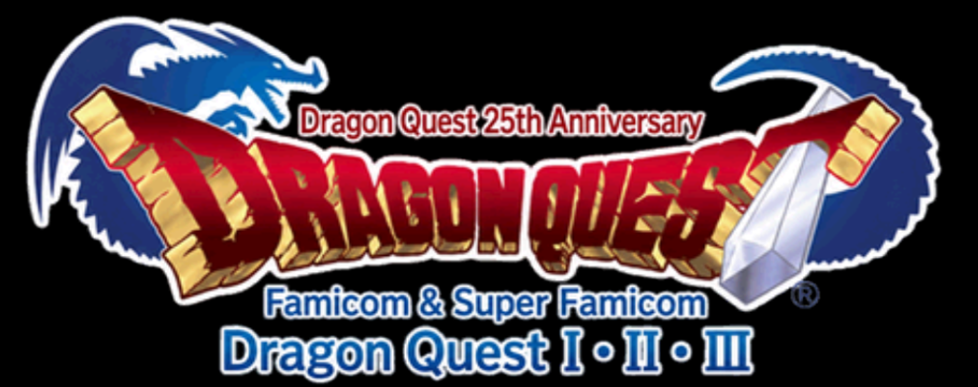
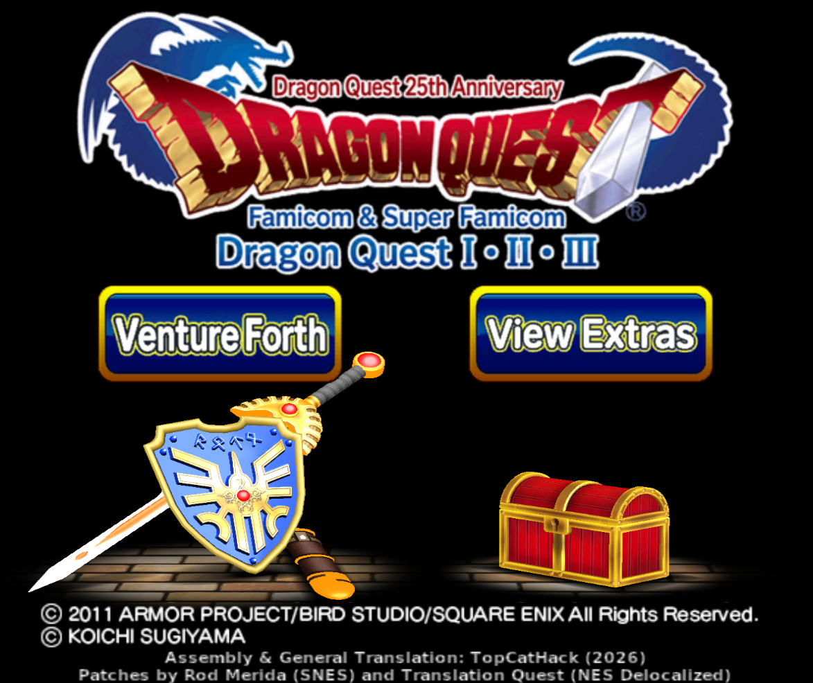
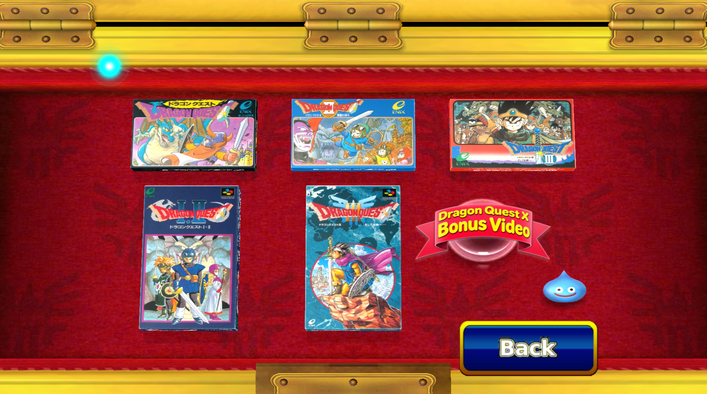
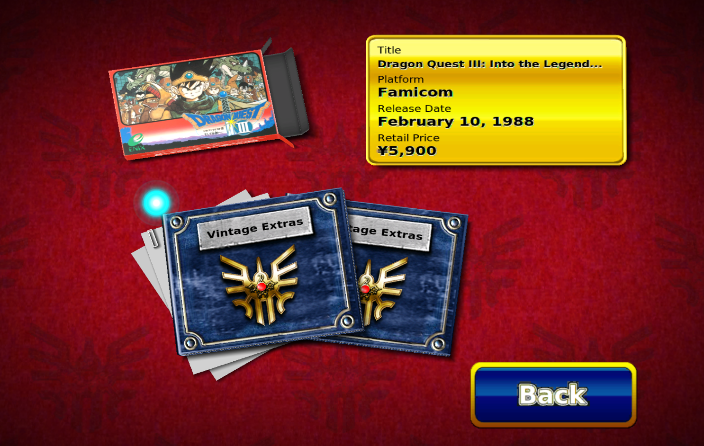
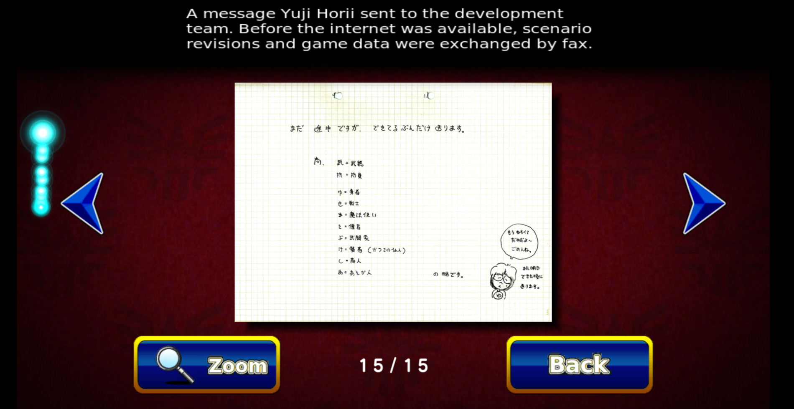
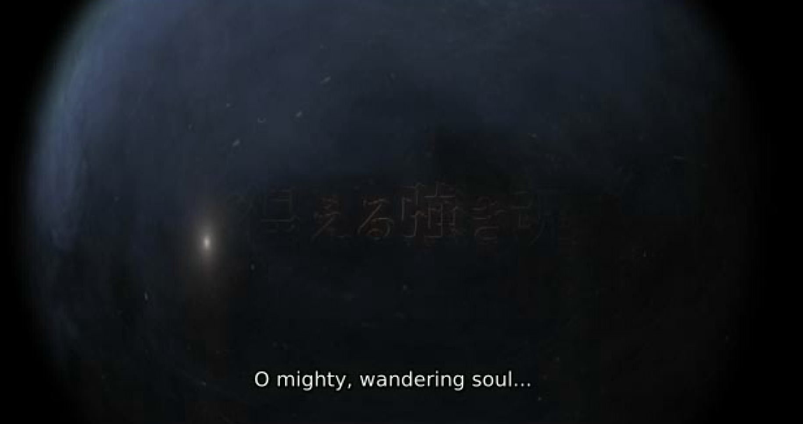
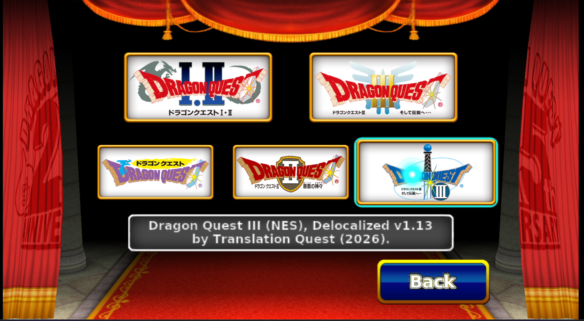

# Dragon Quest 25th Anniversary Collection: English Translation for Wii

An English translation of the Japanese Nintendo Wii collection, assembled by **TopCatHack (2026)**. It integrates existing fan translations of all five included game releases and translates the surrounding collection interface.

## Status

**Beta v0.95.** Available as an xdelta disc-image patch and a Riivolution package in the same [pre-release](https://github.com/topcatromhacking-lgtm/dragon-quest-25th-wii-english/releases/tag/v0.95).

The tester reports all five games working in Dolphin, with HOME menus, SRAM saving/loading, suspend/resume and a saved Riivolution preset. Real Wii testing and full playthroughs remain pending. These are user-reported results, not a compatibility guarantee for every emulator version or loader.

## What is translated

The five included games use the translations credited below. Collection work includes main and game-selection menus, launch and save-related controls, emulator notices and controller warnings, HOME menus, extras labels and archived-item headers, collection logos, translation credits, and English subtitles for the Dragon Quest X bonus video.

The SNES translator introductions are retained after the controller warning. The original archived artwork, maps, posters, packaging and manuals remain Japanese; their interface labels and item headers are translated. Individual game-selection logos are retained.

## Known issues and TODO

Real Wii compatibility and complete playthroughs need testing. Report remaining Japanese text, layout problems, missing resources, save issues or failed transitions. The translated disc title and banner in the xdelta build may be displayed differently from the original disc used with Riivolution; a named Dolphin preset provides a separate English entry.

## Downloads and installation

[**Download the v0.95 xdelta patch**](https://github.com/topcatromhacking-lgtm/dragon-quest-25th-wii-english/releases/download/v0.95/Dragon.Quest.I-II-III.25th.Anniversary.Collection.v0.95.ENG-TopCatHack.xdelta)

[**Download the v0.95 Riivolution package**](https://github.com/topcatromhacking-lgtm/dragon-quest-25th-wii-english/releases/download/v0.95/DQ25_Wii_English_v0.95_Riivolution.zip.zip)

Choose one method. **xdelta** creates a translated ISO that can be launched normally. **Riivolution** loads replacement files while running the original Japanese game. Use Riivolution with the original game, rather than applying it over an already translated image.

### Required Japanese game and ISO checksums

| Identifier | Value |
| --- | --- |
| Title | Dragon Quest 25 Shuunen Kinen - Famicom & Super Famicom Dragon Quest I-II-III (Japan) |
| Disc ID | `S25JGD` |
| Serial | `RVL-S25J-JPN` |
| Version | `1.0` |
| Disc number / revision | `0 / 0` |
| Source ISO size used by the xdelta tool | `4699979776` bytes |
| SHA-1 (supplied Japanese disc reference) | `7B71E822DF4C43D8E09AC4E12AAC16E653E4A2A9` |
| MD5 (supplied reference) | `56CC2A78614B6A1E366D2358A5CEBEAC` |
| CRC32 (supplied reference) | `4FF701B5` |
| SHA-256 (exact xdelta source recorded for this build) | `35F1F53687C4976FB80CA087133DCBAAE426BF4FAD1F5163426F7E890454876C` |

The SHA-1, MD5 and CRC32 are the supplied disc-reference values. They have not been independently checked against the exact xdelta source here. **For xdelta, the source must match the recorded SHA-256 and size.** Matching a filename or disc ID alone is insufficient. A scrubbed image or a WBFS converted back to ISO can have different bytes despite containing the same game.

To check an ISO in PowerShell:

```powershell
Get-FileHash "original.iso" -Algorithm SHA256
Get-FileHash "original.iso" -Algorithm SHA1
```

### Disc-image formats

| Format | Use |
| --- | --- |
| `.iso` | Normal disc dump; use the exact matching original ISO for xdelta patching. Dolphin can launch it directly. |
| `.wbfs` | Works on modded Wii hardware through compatible USB loaders and in Dolphin. |
| `.rvz` | Smaller on average and intended for Dolphin; not a format for normal Wii USB loaders. |

Apply xdelta to the matching **ISO first**, then convert the translated output to WBFS or RVZ if desired. For Riivolution in Dolphin, the original Japanese game can be an ISO, WBFS or RVZ; the same XML and replacement folders are used. Image-format support does not establish real Wii Riivolution compatibility.

### xdelta: create the translated ISO

Download the xdelta asset and [xdelta3](https://github.com/jmacd/xdelta/releases). Keep your original ISO unchanged and select a new output filename. With xdelta3 on PATH, run:

```text
xdelta3 -d -s "original.iso" "Dragon.Quest.I-II-III.25th.Anniversary.Collection.v0.95.ENG-TopCatHack.xdelta" "DQ25_English_v0.95.iso"
```

A compatible graphical xdelta patcher can also be used: select the Japanese ISO as the source, the downloaded xdelta as the patch, and a new ISO as the output. Do not bypass checksum errors.

For automatic source and patch SHA-256 checks, download the repository's current **main branch** using **Code > Download ZIP**, extract it, and use Python 3.9 or newer:

```text
python scripts/apply_xdelta.py "original.iso" "Dragon.Quest.I-II-III.25th.Anniversary.Collection.v0.95.ENG-TopCatHack.xdelta" "DQ25_English_v0.95.iso"
```

Add `--xdelta-bin "C:\path\to\xdelta3.exe"` if needed. On Windows, use `py` instead of `python` if that is how your installation is configured. The script checks the source and v0.95 patch, reconstructs a temporary ISO, prints the output SHA-256 and refuses to overwrite an existing output. Allow roughly 9.5 GB of free space for its temporary reconstruction and final copy. An independently confirmed output hash can be supplied with `--expected-output-sha256`.

### Dolphin: xdelta image

Add the translated ISO to Dolphin's game folders and launch it normally. No Riivolution configuration is needed. You can convert this translated ISO to RVZ using Dolphin's **Convert File…** option, or to WBFS with an appropriate disc-image tool.

Dolphin may display the original Japanese title from its game database. To show the translated image's own title, disable **Use Built-In Database of Game Names** under **Config > Interface**, then refresh the game list.

### Dolphin: Riivolution

Extract the Riivolution ZIP to a permanent folder. Keep `riivolution` and `dq25-english` together at the same level:

```text
DQ25-English/riivolution/DQCollectionEnglish.xml
DQ25-English/dq25-english/files/
```

Right-click the **original Japanese game** in Dolphin and select **Start with Riivolution Patches…**. Click **Open Riivolution XML…**, select `riivolution/DQCollectionEnglish.xml`, enable **English translation**, and start the game. Leave the replacement files extracted; Dolphin needs their folders when launching.

#### Save a JSON preset

In the Riivolution launch window, enable the English option and click **Save as Preset…**. Save it in a folder Dolphin scans for games, for example:

```text
Dragon Quest 25th Anniversary - English.json
```

Refresh the game list. If necessary, add the preset's folder under **Config > Paths > Game Folders**. Launch the preset entry to apply the translation automatically, or open the JSON through Dolphin's **Open** button.

The preset records the original game, patch XML and selected options. Keep their paths stable. If you move the image or patch folders, or replace the original ISO with an RVZ/WBFS, create a new preset using that image. Each user should create their own preset rather than use one containing another person's file paths.

### Modded Wii: xdelta image through a USB loader

On your computer, create the translated ISO as described above. Use Wii Backup Manager or [Wiimms ISO Tools](https://wit.wiimm.de/) to convert or transfer it to WBFS for your compatible USB loader. A typical layout is:

```text
USB:/wbfs/Dragon Quest 25th Anniversary English [S25JGD]/S25JGD.wbfs
```

Refresh the loader's game list and launch the translated game normally. The patch keeps the Japanese game ID and region. Use a loader configured to launch that region, and keep existing saves backed up. Do not add the Riivolution package on top of the translated image. **This hardware route has not yet been tested for this release.**

### Modded Wii: Riivolution with the original disc

You need the Homebrew Channel, [Riivolution](https://riivolution.github.io/wiki/Riivolution/) and the **original Japanese retail disc**. Install Riivolution by extracting its `apps` folder to your SD card. Extract this translation's package and copy `riivolution` and `dq25-english` directly to the SD root:

```text
SD:/apps/riivolution/boot.dol
SD:/riivolution/DQCollectionEnglish.xml
SD:/dq25-english/files/
```

Insert the original disc, open Riivolution through the Homebrew Channel, enable **English translation**, and launch. Retain the complete replacement folder. Test all five game launches, controller warnings, HOME, SRAM saving/loading, suspend/resume and return to the collection.

Standard Riivolution uses the retail disc; it does not launch a WBFS through a normal USB loader. For USB-loader playback, use the xdelta/WBFS route above. **Real Wii Riivolution testing remains pending**, especially the transitions into the collection's separate emulator executables.

### Updating or disabling the patch

Stop the game before replacing patch files and back up saves. Update the Riivolution XML and replacement folder together to avoid mixing versions. To disable Riivolution, disable the English option or launch the original game without the English preset. For xdelta, keep the original image separately and rebuild each new version from that matching original.

### Package checksums

SHA-256 of the uploaded v0.95 xdelta asset:

```text
10092bad614eb40382d14f0b8fb378489ab1e6fa58207c86b4722169e5d254f0
```

SHA-256 of the uploaded `DQ25_Wii_English_v0.95_Riivolution.zip.zip` asset:

```text
f798bac9448bf0cef03c2e1a21b3fa37a3aeb5ca081a0f7cb90c3fc10c492b2c
```

These identify the release downloads, not the source or reconstructed ISO.

## Screenshots

| Title screen | Extras menu | Game information |
| --- | --- | --- |
|  |  |  |

| Vintage extras | Development notes | Bonus video |
| --- | --- | --- |
|  |  |  |

| Game selection | Adventure Log and suspend menu |
| --- | --- |
|  |  |

## Reporting problems

Open a [GitHub issue](https://github.com/topcatromhacking-lgtm/dragon-quest-25th-wii-english/issues/new/choose) with the patch version, xdelta or Riivolution method, affected game or screen, steps to reproduce, and a screenshot. Include your Dolphin version or Wii model and loader, and say whether the issue follows a fresh launch, SRAM load or suspend-state resume. A normal in-game save is helpful when available. For visual problems, mention 4:3 or 16:9.

## Credits

Assembly, general translation and Wii collection adaptation: **TopCatHack (2026)**.

| Game | Translation | Credits |
| --- | --- | --- |
| Dragon Quest (NES) | Delocalized v1.19 | Translation Quest (2026) |
| Dragon Quest II (NES) | Delocalized v1.21 | Translation Quest (2026) |
| Dragon Quest III (NES) | Delocalized v1.13 | Translation Quest (2026) |
| Dragon Quest I & II (SNES) | Addendum v1.053rtm | Rod Merida (2021); original translation by RPGOne (2002) |
| Dragon Quest III (SNES) | Addendum v1.0c | Rod Merida (2022); original translation by DQTranslations (2009) |

The underlying game translations belong to their respective authors. Original game and collection: Square Enix and the original development teams. AI assisted with technical analysis, adaptation tooling, patch development, asset editing and troubleshooting, with user review and testing. xdelta3, Wiimms ISO Tools, Riivolution and Dolphin belong to their respective contributors.

This is an unofficial fan project, distributed free of charge. It must not be sold. Dragon Quest belongs to its respective rights holders. Do not distribute full disc images through this repository.

Developer conversion notes and structural checks are in [docs/RIIVOLUTION.md](docs/RIIVOLUTION.md). Installation references: [Riivolution](https://riivolution.github.io/wiki/Riivolution/), [Riivolution FAQ](https://riivolution.github.io/wiki/Frequently_Asked_Questions/), and [Dolphin supported formats](https://dolphin-emu.org/docs/faq/#what-dump-formats-are-supported-by-dolphin).
